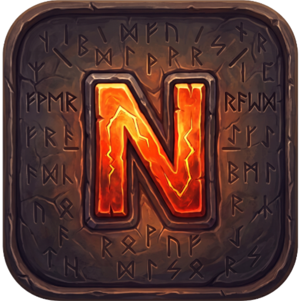
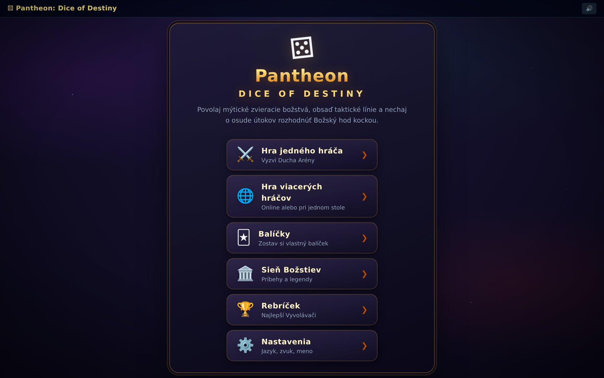
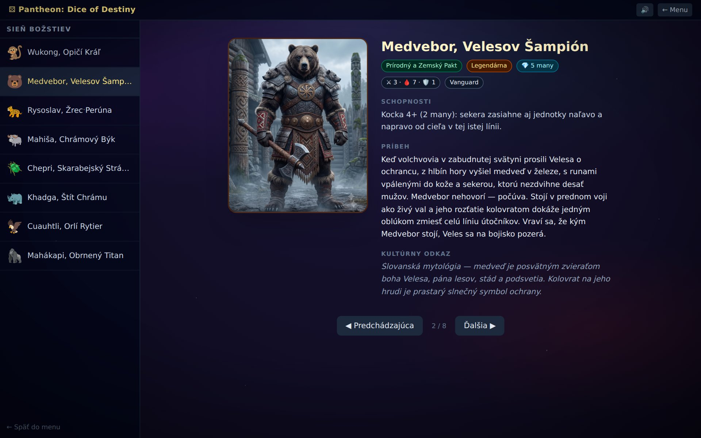
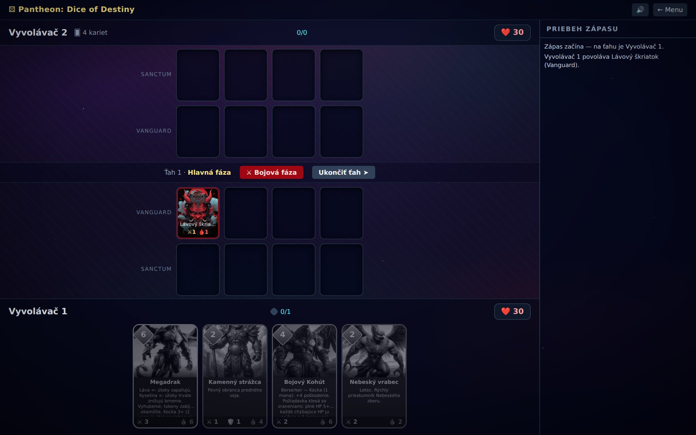
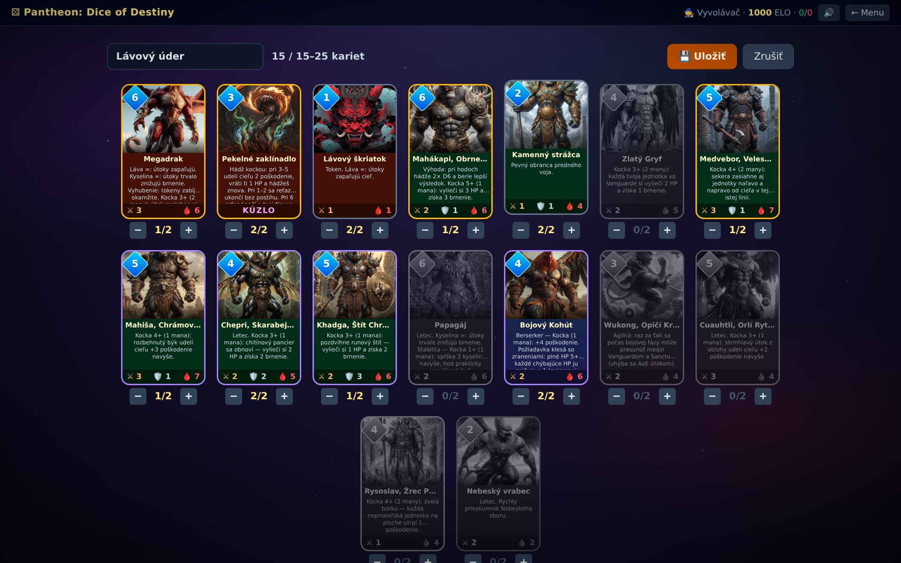
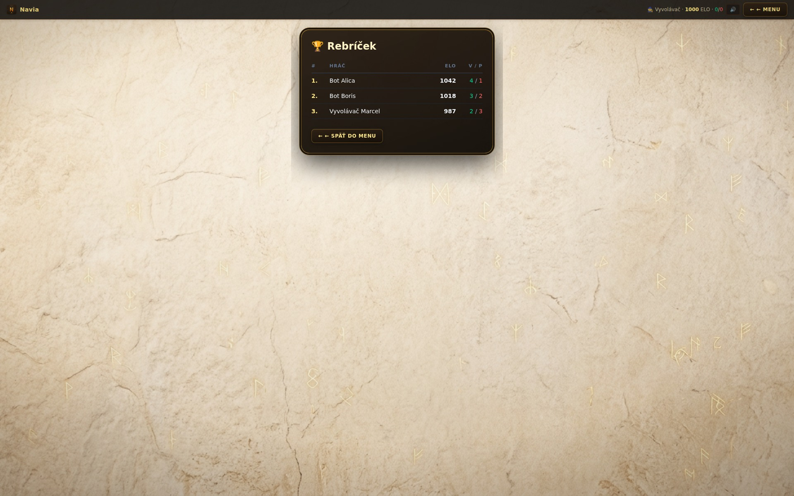

<div align="center">



# ⚄ Navia

**Ovládni silu zvieracích božstiev.** Zostav balíček z mýtických tvorov naprieč
kultúrami sveta, vylož karty do taktických línií a nechaj o osude každého
útoku rozhodnúť Božský hod kockou.

[](https://github.com/bucala/Navia/actions/workflows/ci.yml)
[](https://github.com/bucala/Navia/actions/workflows/android.yml)
[](LICENSE)
[](https://www.typescriptlang.org/)
[](https://react.dev/)
[](https://workers.cloudflare.com/)
[](public/manifest.webmanifest)
[](src/i18n)

[Hrateľné funkcie](#-hrateľné-funkcie) •
[Galéria](#-galéria) •
[Technológie](#-technológie) •
[Rýchly štart](#-rýchly-štart) •
[Android APK](#-android-apk) •
[Changelog](CHANGELOG.md) •
[GDD](docs/GDD.md)

</div>

---

## 📖 O hre

**Navia** je multiplayer zberateľská kartová hra, ktorá spája prístupnosť
a vizuálnu eleganciu hier ako *Hearthstone* s taktickým rozmiestňovaním na
hracej ploche (*Gwent*) a nepredvídateľným vzrušením z hádzania kociek
stolových RPG. Hráči preberajú rolu **Vyvolávačov**, ktorí v astrálnych
arénach povolávajú do boja mýtické zvieracie božstvá — od slovanského
Medvebora cez čínskeho Wukonga až po egyptského Chepriho. Jadrom stratégie
nie je len to, akú kartu zahráš, ale ako dokážeš manažovať riziko pomocou
**Božského hodu kockou (D6)**.

Kompletný herný návrh (mechaniky, frakcie, technologická architektúra) je
v [Game Design Document](docs/GDD.md) pod pracovným názvom *Pantheon: Dice
of Destiny*.

## 🎮 Hrateľné funkcie

| | |
|---|---|
| ⚄ **Kockový D6 engine** | Základný útok bez rizika, alebo priplať za hod kockou a odomkni devastujúci efekt. Výhoda (2× D6, lepší výsledok) aj Push-your-luck reťaze s rizikom Overloadu na šestke. |
| 🛡️ **Taktické línie** | Vanguard chráni Sanctum — kým stojí predný voj, zadná línia aj Nexus súpera sú mimo dosahu. |
| 🏛️ **Sieň Božstiev** | Listovateľný kódex 8 hrdinov s vlastným menom, príbehom a kultúrnym odkazom (slovanská, čínska, aztécka, egyptská a hinduistická mytológia). |
| ⚔️ **Hra jedného hráča** | Súboj proti **Duchovi Arény** — AI súperovi, ktorý vykladá jednotky, útočí podľa pravidla predného voja a platí za kockové schopnosti. |
| 🌐 **Online multiplayer** | Rýchla hra (automatický matchmaking) alebo súkromná miestnosť s pozvánkovou linkou. Server je jediná autorita nad stavom hry aj hodmi kociek — klient si nikdy nehádže sám. |
| 🃏 **Deckbuilder** | Balíčky 15–25 kariet, max 2 kópie od karty, validácia na klientovi aj serveri. |
| 🏆 **ELO rebríček** | Hodnotené online zápasy zapisujú ELO (K=32), výhry/prehry aj históriu zápasov. |
| 🇸🇰🇬🇧 **SK/EN lokalizácia** | Slovenčina predvolená, angličtina kompletne paralelná — vrátane živého herného logu a chybových hlášok. |
| 📱 **PWA + Android** | Inštalovateľná webová appka, natívny Android build cez Capacitor (pozri [Android APK](#-android-apk)). |
| 🎬 **Plnohodnotné efekty** | 3D animácia kocky s dopadom a odskokom, otrasenie obrazovky pri šestke, animácie súbojov cez Framer Motion, procedurálne zvuky cez WebAudio (bez jediného audio súboru). |

## 🖼️ Galéria

<table>
<tr>
<td width="50%"><br><sub>Tematické hlavné menu</sub></td>
<td width="50%"><br><sub>Sieň Božstiev — Medvebor, Velesov Šampión</sub></td>
</tr>
<tr>
<td width="50%"><br><sub>Taktické línie Vanguard / Sanctum</sub></td>
<td width="50%"><br><sub>Deckbuilder s validáciou balíčka naživo</sub></td>
</tr>
<tr>
<td colspan="2"><br><sub align="center">ELO rebríček</sub></td>
</tr>
</table>

## 🧩 Frakcie a postavy

| Frakcia | Zameranie | Vybraní hrdinovia |
|---|---|---|
| 🔥 **Lávový dvor** | Útok a deštrukcia (Láva ∞, Kyselina ∞) | Megadrak, Pekelné zaklínadlo |
| 🌿 **Prírodný a Zemský Pakt** | Obrana a stabilita | Mahákapi, Medvebor, Mahiša, Chepri, Khadga |
| 🕊️ **Nebeský Zbor** | Mobilita a podfuky | Wukong, Cuauhtli, Rysoslav, Bojový Kohút |

Každá postava má v [Sieni Božstiev](src/game/lore.ts) vlastný príbeh a
kultúrny odkaz — slovanská mytológia (Veles, Perún), čínska *Cesta na
západ* (Wukong), aztécki orlí bojovníci (Cuauhtli), staroegyptský Chepri,
hinduistický Mahišásura a budhistická džátaka o Veľkej opici (Mahákapi).

## 🛠️ Technológie

| Vrstva | Technológia |
|---|---|
| **Frontend** | React 18 · TypeScript · Vite · Tailwind CSS · Framer Motion |
| **Herný engine** | Čistý TypeScript reducer (`src/game/`), zdieľaný medzi klientom a serverom |
| **Backend** | Cloudflare Workers · Durable Objects (`GameRoom`, `Matchmaker`) |
| **Databáza** | Cloudflare D1 (SQLite na edge) — účty, balíčky, ELO, história zápasov |
| **Sieťovanie** | WebSockets, prísne typovaný protokol |
| **Mobilné** | Capacitor (Android), PWA manifest |
| **Testovanie** | Vitest (41+ unit testov enginu, kociek, AI, balíčkov) |
| **CI/CD** | GitHub Actions — testy/build pri každom PR, automatický Android build |

## 🚀 Rýchly štart

```bash
git clone https://github.com/bucala/Navia.git
cd Navia
npm install

# raz: lokálna D1 schéma
npx wrangler d1 migrations apply pantheon-db --local

npm run dev          # vývojový server (Vite) — /api sa proxuje na worker
npm run dev:worker   # Cloudflare Worker + Durable Objects + D1 lokálne (port 8787)
npm test             # unit testy (Vitest)
npm run build        # typová kontrola (app + worker) + produkčný build
npm run deploy       # build + wrangler deploy na Cloudflare
```

Online hru lokálne spustíš buď cez `npm run build && npm run dev:worker`
(worker servuje aj frontend z `dist/`), alebo počas vývoja dvomi terminálmi:
`npm run dev:worker` + `npm run dev`.

Pred prvým nasadením na Cloudflare vytvor produkčnú D1 databázu:
`wrangler d1 create pantheon-db`, vlož vrátené `database_id` do
`wrangler.toml` a spusti `wrangler d1 migrations apply pantheon-db --remote`.

## 📱 Android APK

APK sa **builduje automaticky** pri každom pushi do `main`
([`.github/workflows/android.yml`](.github/workflows/android.yml)) —
`versionName` sa berie z `package.json`, `versionCode` je číslo behu, takže
každý build nesie presnú a rastúcu verziu.

- **Najnovší build:** záložka [Actions → Android Build](https://github.com/bucala/Navia/actions/workflows/android.yml) → posledný úspešný beh → artefakt `pantheon-dice-of-destiny-v*` (obsahuje debug APK, prípadne aj podpísaný release APK, ak sú v repozitári nastavené signing secrets).
- **Vydané verzie:** push tagu `v*` (napr. `v0.9.0`) navyše vytvorí [GitHub Release](https://github.com/bucala/Navia/releases) s priloženým APK.

Manuálny build:

```bash
# 1. web build s adresou nasadeného Workera (backend nie je súčasťou APK)
VITE_API_BASE=https://pantheon-dice-of-destiny.<ucet>.workers.dev npm run build

# 2. skopírovanie web buildu do natívneho projektu
npx cap sync android

# 3. build APK (vyžaduje Android Studio alebo Android SDK + JDK 17)
cd android && ./gradlew assembleDebug
# → android/app/build/outputs/apk/debug/app-debug.apk
```

## 📂 Štruktúra

```
docs/GDD.md           herný návrh (Game Design Document)
docs/screenshots/     obrázky pre README
CHANGELOG.md          história vydaní
wrangler.toml         Cloudflare Worker + Durable Objects konfigurácia
capacitor.config.ts   Capacitor (Android) konfigurácia; natívny projekt je v android/
.github/workflows/    CI (testy/build) a automatický Android build
migrations/           D1 schéma (hráči, balíčky, zápasy)
src/game/             čistá herná logika (bez UI) — beží u klienta aj v Durable Objecte
  types.ts              dátové modely (karty, stav hry, akcie)
  cards.ts              katalóg kariet a testovací balíček
  dice.ts               kockový engine D6
  engine.ts             reducer herných akcií
  ai.ts                 Duch Arény (AI súper)
  lore.ts               príbehy a kultúrne odkazy (Sieň Božstiev)
src/net/              WebSocket protokol, profily (D1 účty) + hook useMultiplayerGame
src/worker/           Cloudflare Worker router, profil/deck/leaderboard API + GameRoom a Matchmaker DO
src/i18n/             slovenské a anglické preklady
src/ui/               React komponenty (plocha, karty, kocky, kódex, lobby, deckbuilder, rebríček)
src/App.tsx           hlavné menu
```

## 🗺️ Roadmapa

- [x] **Fáza 1:** Core Engine + lokálna Pass & Play
- [x] **Fáza 2:** Sieťovanie — Cloudflare Durable Objects + WebSockets
- [x] **Fáza 3:** Assety a frakcie — art pipeline, 3D kocky, animácie, zvuky
- [x] **Fáza 4:** Matchmaking („Rýchla hra") a Android/PWA
- [x] **Fáza 5:** D1 perzistencia — účty, ELO rating, rebríček, deckbuilder
- [x] Tematické menu, hra jedného hráča, ďalší hrdinovia, SK/EN lokalizácia
- [x] Dokumentácia (README, CHANGELOG) a CI/CD
- [x] Oprava značky Navia naprieč appkou, oprava hrateľnosti a **📜 Ako hrať** v menu

Detailná história zmien je v [CHANGELOG.md](CHANGELOG.md).

## 📄 Licencia

Projekt je uvoľnený pod licenciou [MIT](LICENSE).
