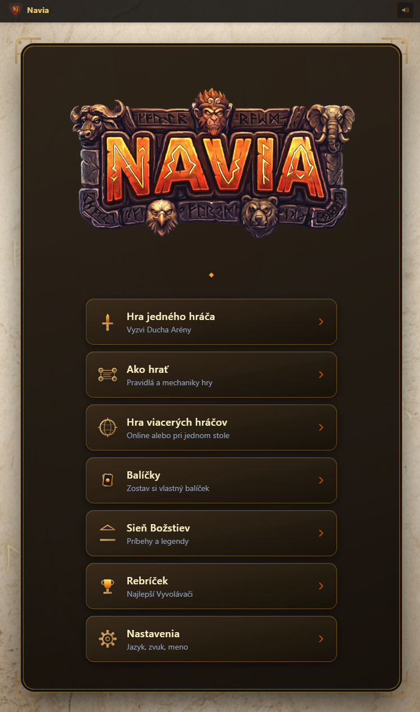
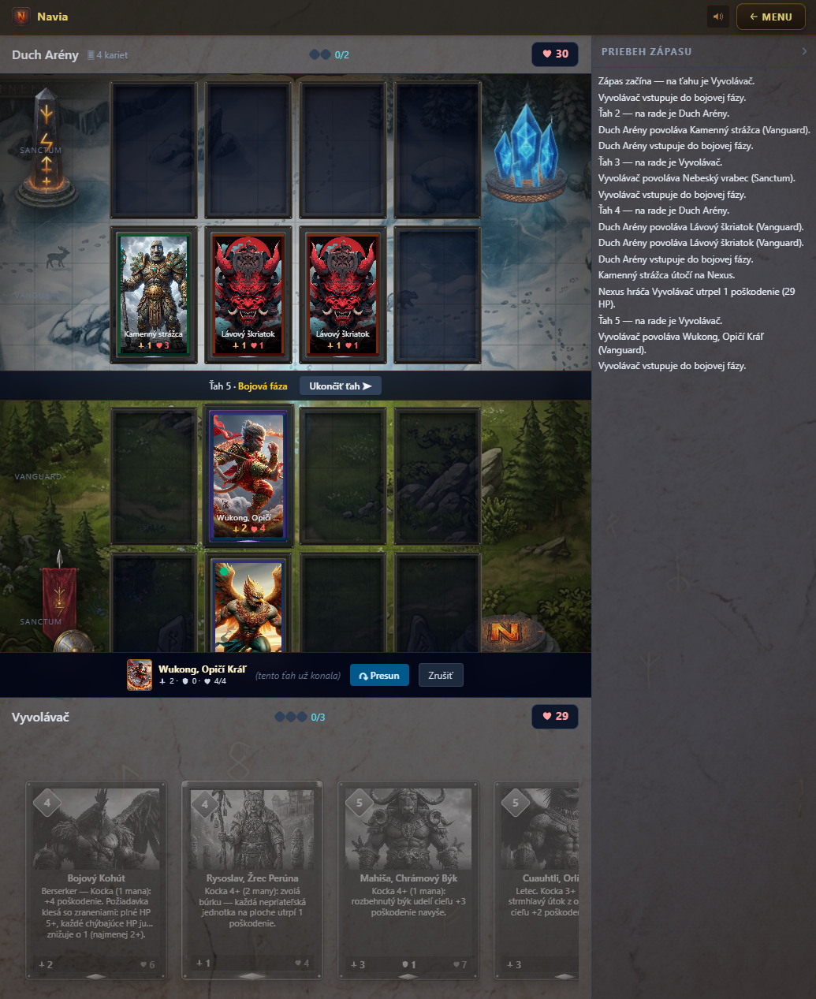
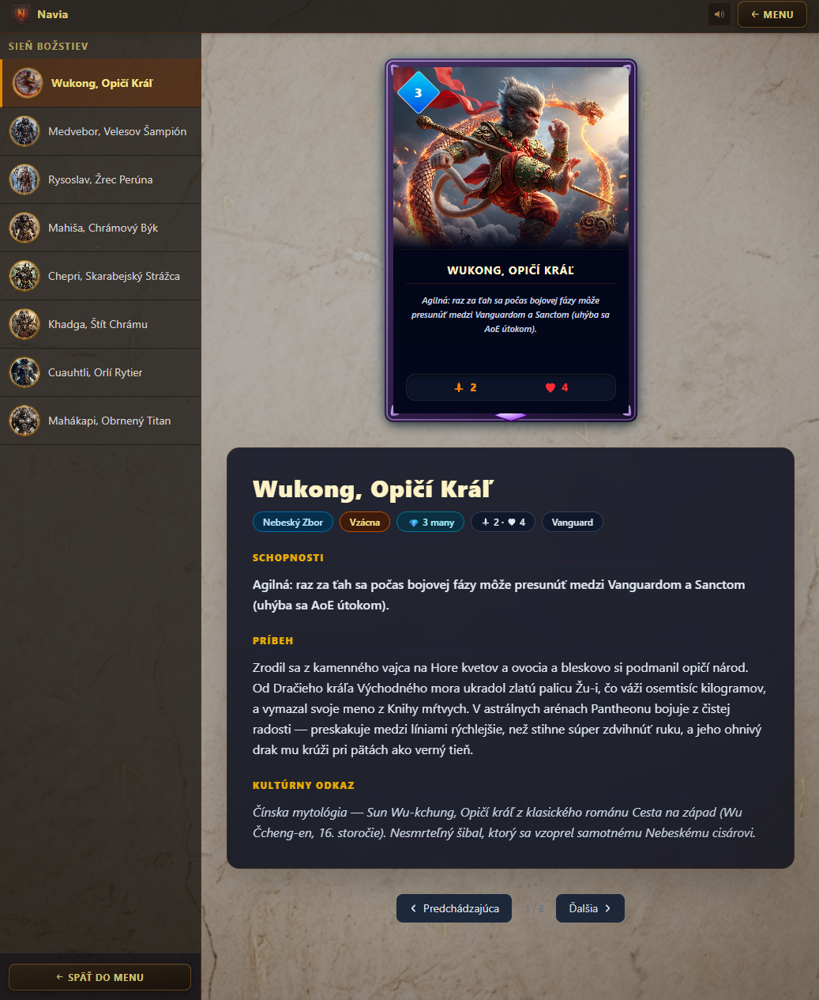
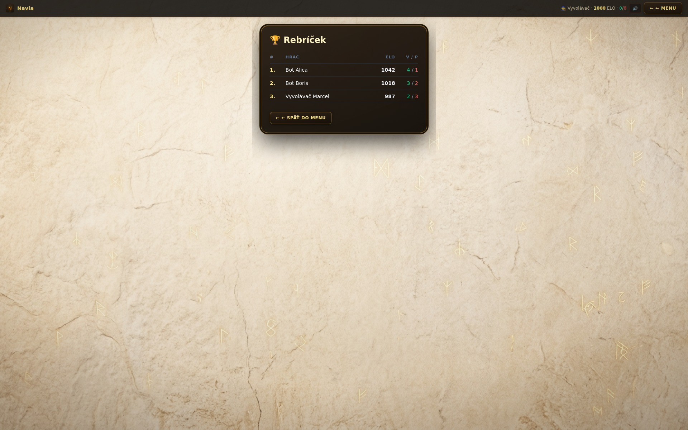
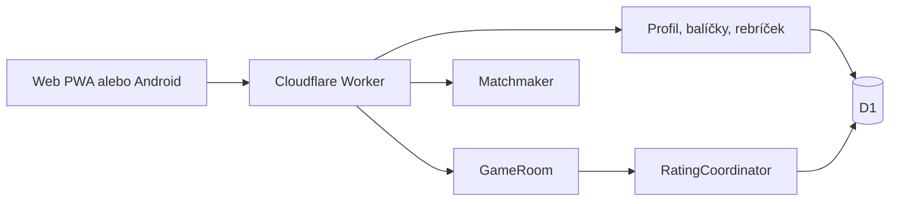

# Navia

**Taktická kartová hra s líniami, mytologickými šampiónmi a hodmi D6.**

[](https://github.com/bucala/Navia/actions/workflows/ci.yml)
[](https://github.com/bucala/Navia/actions/workflows/android.yml)
[](CHANGELOG.md)
[](LICENSE)

> Aktuálna verzia: **0.12.1**. Web funguje ako responzívna PWA, rovnaký
> frontend sa balí aj do natívnej Android aplikácie cez Capacitor.

## O hre

Každý hráč bráni Nexus s 30 HP. Jednotky vykladá do Vanguarda alebo Sancta,
spravuje manu a pri špeciálnych schopnostiach riskuje hod kockou. Zápas možno
hrať proti AI, vo dvojici na jednom zariadení alebo online.

Kompletné pravidlá a pôvodný návrh sú v
[Game Design Documente](docs/GDD.md) pod pracovným názvom
*Pantheon: Dice of Destiny*.

## Hrateľné funkcie

| Oblasť | Stav vo verzii 0.12.1 |
| --- | --- |
| Herný engine | Čistý TypeScript reducer, dve línie po štyroch slotoch, fázy Main/Combat, mana, brnenie, Nexus a D6 schopnosti. |
| Férový začiatok | Náhodne vybraný prvý hráč, automatický mulligan nehrateľnej ruky a jedna karta navyše pre druhého hráča. |
| Ukončenie zápasu | Zničenie Nexusu, rastúca únava po vyčerpaní balíčka alebo bezpečnostný limit 80 hráčskych ťahov. |
| Herné režimy | AI, lokálny duel, súkromná online miestnosť s pozvánkou a rýchle online párovanie. |
| Online autorita | `GameRoom` drží stav a generuje náhodu na serveri; každý hráč dostáva iba svoju privátnu ruku. |
| Čas online ťahu | 90-sekundový limit, automatické ukončenie zmeškaného ťahu a prehra po druhom timeout-e. |
| Profily | Meno, ELO, výhry/prehry, vlastné balíčky a rebríček v Cloudflare D1. |
| Karty | 16 kariet z troch frakcií, vrátane Lavy, Kyseliny, Vyhubenia, Výhody, Berserkera, Agility a Lietania. |
| Jazyk a prístupnosť | Slovenčina/angličtina, klávesnicové ovládanie, sémantické dialógy, live regions a rešpektovanie `prefers-reduced-motion`. |
| PWA a Android | Inštalovateľná PWA s bezpečnou výzvou na aktualizáciu, offline app shell a Android wrapper s haptikou a šifrovaným úložiskom prihlasovacích údajov. |
| Vizuál | Aktuálna kamenno-pergamenová identita, Navia runová značka a ilustrovaná aréna bez posúvania rozloženia pri výbere akcie. |
| Testovanie | 93 testov v 9 Vitest súboroch pre engine, kocky, AI, balíčky, protokol a Durable Objects. |

## Galéria

| Hlavné menu | Herná plocha |
| --- | --- |
|  |  |

| Kódex | Rebríček |
| --- | --- |
|  |  |

## Frakcie a postavy

| Frakcia | Štýl | Príklady |
| --- | --- | --- |
| Lávový dvor | tlak, oheň a rozklad brnenia | Megadrak, Lávový škriatok, Pekelné zaklínadlo |
| Prírodný a Zemský pakt | obrana, liečenie a stabilita | Mahákapi, Medvebor, Zlatý Gryf, Mahiša, Chepri, Khadga |
| Nebeský zbor | mobilita a taktické podfuky | Papagáj, Bojový Kohút, Wukong, Cuauhtli, Rysoslav |

## Technológie a architektúra

| Vrstva | Technológie |
| --- | --- |
| Frontend | React 18, TypeScript, Vite 6, Tailwind CSS 4, Framer Motion |
| Backend | Cloudflare Workers a Durable Objects (`GameRoom`, `Matchmaker`, `RatingCoordinator`) |
| Dáta | Cloudflare D1, SQL migrácie v `migrations/` |
| PWA | Web App Manifest a vlastný service worker |
| Android | Capacitor 8, Java, AndroidX, AES/GCM cez Android Keystore |
| Testovanie a CI | Vitest, GitHub Actions, web build a Android test/lint/build |


```mermaid
flowchart LR
  A[Web PWA alebo Android] --> W[Cloudflare Worker]
  W --> API[Profil, balíčky, rebríček]
  W --> G[GameRoom]
  W --> M[Matchmaker]
  G --> R[RatingCoordinator]
  API --> D[(D1)]
  R --> D
```

Worker obsluhuje frontend aj API z jedného originu. Durable Objects
serializujú online zápasy, matchmaking a idempotentný zápis výsledkov.

## Rýchly štart

Požiadavky: **Node.js 22+** a npm.

```bash
git clone https://github.com/bucala/Navia.git
cd Navia
npm ci
npm run dev
```

Kontroly pred odoslaním zmeny:

```bash
npm test
npm run build
```

Lokálny Cloudflare Worker s lokálnou D1 databázou:

```bash
npx wrangler d1 migrations apply pantheon-db --local
npx wrangler dev
```

## Nasadenie na Cloudflare

1. Prihlás sa cez `npx wrangler login`.
2. Vytvor D1 databázu: `npx wrangler d1 create pantheon-db`.
3. Vlož pridelené `database_id` do `wrangler.toml`.
4. Spusti:

```bash
npm run deploy
```

Deploy skript najprv zostaví web, overí produkčné D1 nastavenie, aplikuje
všetky migrácie na vzdialenú databázu a až potom nasadí Worker.

Ďalšie povolené webové originy možno nastaviť vo `wrangler.toml` cez
`CORS_ALLOWED_ORIGINS`. Produkcia musí používať HTTPS.

## Android APK

Najnovší debug APK je v
[Actions → Android Build](https://github.com/bucala/Navia/actions/workflows/android.yml)
v artefakte `navia-v<versionName>-build<runNumber>`, napríklad
`navia-v0.12.1-build42`. Tag `v*` vytvorí GitHub Release iba vtedy, keď CI
úspešne zostaví podpísaný release APK.

Pre lokálny Android build nastav URL nasadeného Workera a synchronizuj web:

```powershell
$env:VITE_API_BASE="https://pantheon-dice-of-destiny.<ucet>.workers.dev"
$env:VITE_PUBLIC_APP_URL=$env:VITE_API_BASE
npm run build
npx cap sync android
cd android
.\gradlew.bat testDebugUnitTest lintDebug assembleDebug
```

Na iných shelloch nastav rovnaké premenné prostredia ich natívnou syntaxou.
`VITE_PUBLIC_APP_URL` určuje verejnú URL v zdieľaných pozvánkach; ak chýba,
použije sa `VITE_API_BASE`.

## Značka a ikony

Kanonickým zdrojom favicon, PWA a Android ikon je detailný erb v
`public/icons/icon-512.png`. Po jeho zmene spusti `npm run icons`. Príkaz
vytvorí menšie webové ikony, bezpečne odsadenú maskable ikonu a všetky
Android launcher, okrúhle a adaptívne ikony. Android splash používa tie isté
launcher výstupy na tmavom kamennom pozadí, takže nezobrazuje predvolenú
grafiku Capacitoru. Podrobný postup je v
[`public/art/branding/README.md`](public/art/branding/README.md).

## Štruktúra projektu

```text
src/
  game/              čistý engine, karty, AI, balíčky, ELO a validácia akcií
  i18n/              slovenské a anglické texty
  net/               klient API, profilový kontext, protokol a WebSocket hook
  ui/                plocha, režimy hry, kódex, balíčky, rebríček a nastavenia
  worker/            Worker API a GameRoom/Matchmaker/RatingCoordinator
public/
  art/               značka, ilustrácie, ikony a rámy
  icons/             generované PWA/favikony
  manifest.webmanifest
  sw.js
android/              natívny Capacitor projekt
docs/                 GDD a galéria
migrations/           verzované D1 SQL migrácie
scripts/              generovanie ikon a kontrola deploy konfigurácie
```

## Ďalší vývoj

Základ hry, online infraštruktúra, PWA, Android build a bezpečnostné kontroly
sú implementované. Ďalšie verzie sa môžu sústrediť na:

* dlhšie verejné playtesty a ladenie balansu,
* ďalšie karty, ilustrácie, zvuky a animácie,
* sezóny, turnaje a rozšírené sociálne funkcie,
* produkčný signing a publikovanie Android aplikácie.

História hotových zmien je v [CHANGELOG.md](CHANGELOG.md).

## Licencia

Projekt je uvoľnený pod licenciou [MIT](LICENSE).
